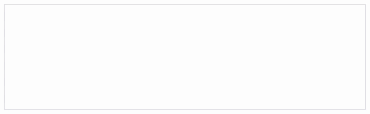

# react-ghost-text

[](https://opensource.org/licenses/MIT)

React component to show ghost text suggestions in an input field (similar to VS Code or Gmail Smart Compose). Key features:
- Displays auto-complete suggestions when the user pauses typing
- Press `tab` to autocomplete (accept a suggestion)
- Press `escape` to reject a suggestion
- Caches suggestions at a particular position (to avoid unnecessary calls to expensive AI services)



## Install

```sh
npm install react-ghost-text
```

## Usage
```typescript
import { AutocompleteTextbox } from 'react-ghost-text';
```

```typescript
export default function Home() {

  // State to store the content of the textbox
  const [content, setContent] = useState<string>("");

  const getSuggestion = async (textUptilCaret: string) => {
    // Fetch suggestion from an AI API, local model, etc.
    return "suggestion";
  };

  return (
    <AutocompleteTextbox
      getSuggestion={getSuggestion}
      onContentChange={content => setContent(content)} />
  )
}
```

## Available Props

### Required Props
|Prop|Description|Type|
|-|-|-|
|`getSuggestion`| A function that retrieves suggestions based on user input. Usually, this will be some sort of API call to a language model. | function |

### Optional Props
|Prop|Description|Type|Default|
|-|-|-|-|
| `debounceTime` | The time to wait after the user stops typing before fetching a suggestion (in ms). Default `1000`. | integer | `1000` |
| `suggestionClassName` | The CSS class name for the span element that contains the suggestion. This is useful for styling the suggestion. Your className will override the default class name. | string | `suggestion` |
| `suggestionStyle` | The inline style for the span element that contains the suggestion. This is useful for styling the suggestion. Your style will override the default style. | object | `{color: "grey"}` |
| `disableAutocomplete` | Disable autocomplete for the component. | boolean | `false` |
| `onSuggestionShown` | An optional callback function that is called after a suggestion has been shown. | function | |
| `onSuggestionAccepted` | An optional callback function that is called when a suggestion is accepted. | function | |
| `onSuggestionRejected` | An optional callback function that is called when a suggestion is rejected. | function | |
| `onContentChange` | An optional callback function that is called when the content of the textbox changes. It is called with the current content of the textbox (as HTML string). Note: This does not include the suggestion, only the main text input by the user. | function | |
| Standard `div` props | This component accepts all standard HTML `div` attributes. This allows you to customize experience (e.g., disable paste by defining `onPaste`). | function | |

